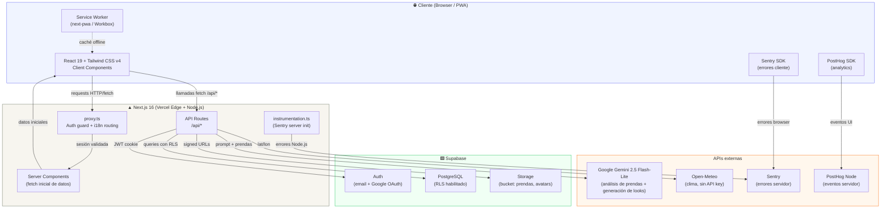
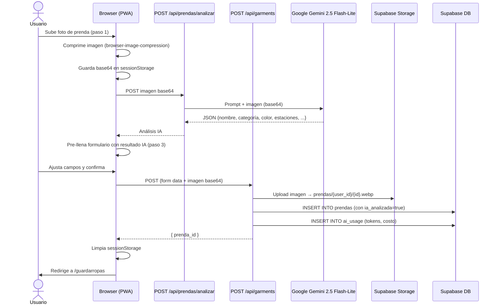
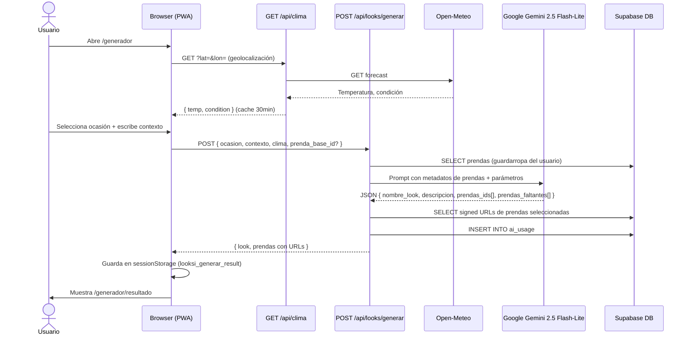
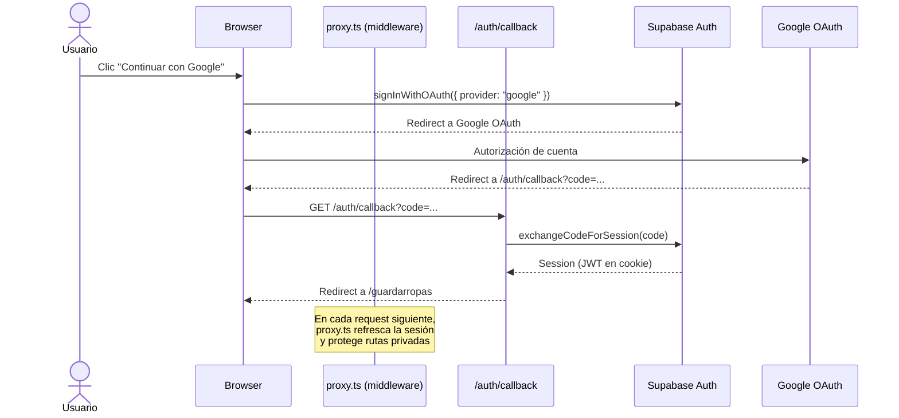

# Diagrama de arquitectura — LookSi

> Renderizable en GitHub, GitLab, y cualquier visor de Mermaid.

---

## Visión general

---

## Flujo: agregar prenda con análisis IA

---

## Flujo: generación de look con IA

---

## Flujo: autenticación (OAuth Google)

---

## Capas y responsabilidades

| Capa | Archivos | Responsabilidad |
|---|---|---|
| **Middleware** | `proxy.ts` | Auth guard + redirección i18n. Corre en Edge Runtime. |
| **Server Components** | `app/[locale]/(app)/*/page.tsx` | Fetch inicial de datos autenticados. Sin lógica de UI. |
| **Client Components** | `components/features/*/` | Estado, interacciones, llamadas a API. |
| **API Routes** | `app/api/*/route.ts` | Lógica de negocio server-side. Nunca exponen secrets. |
| **DB / Storage** | `supabase/migrations/` | PostgreSQL con RLS + Storage con políticas de bucket. |
| **Servicios externos** | `lib/`, `app/api/` | Gemini y Open-Meteo solo llamados desde API Routes. |
