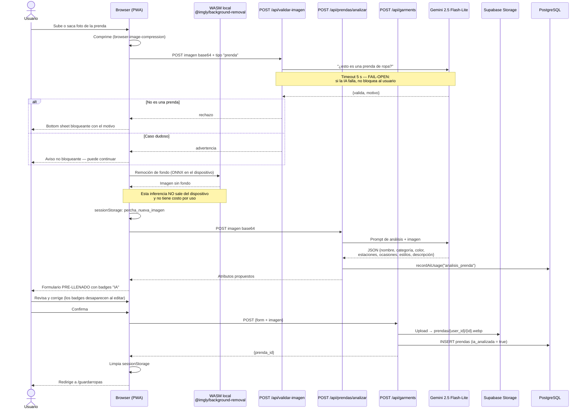
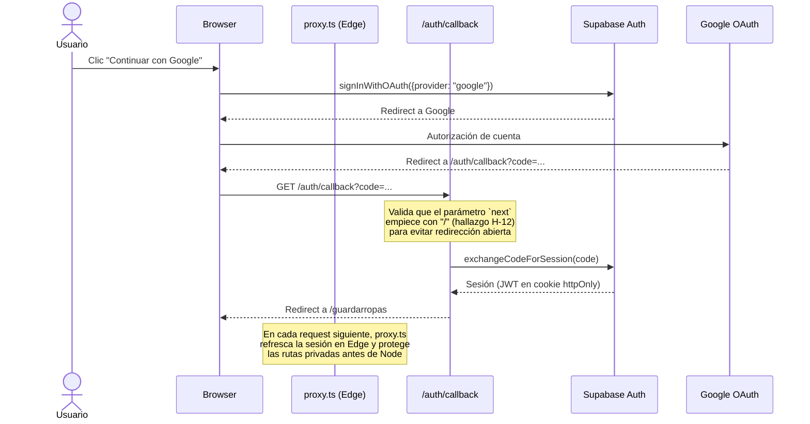
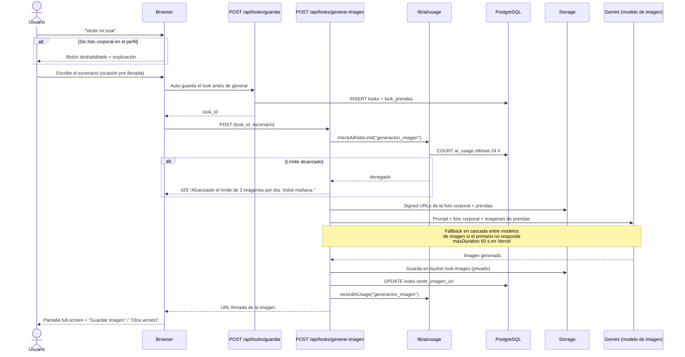

# Anexo A — Diagramas completos

> Complemento de la Sección 2 del [informe principal](../informe-principal.md).
> Fuente original: [`docs/architecture/diagrama-arquitectura.md`](../../architecture/diagrama-arquitectura.md) y [`docs/database/schema.md`](../../database/schema.md).

---

## A.1 · UML — Modelo de datos (diagrama entidad-relación)

Este es el diagrama de clases/entidades del sistema. Es también el mapa de la **memoria persistente**: cada tabla es una memoria que alimenta decisiones futuras de los agentes.

```mermaid
erDiagram
    auth_users {
        uuid id PK
        text email
        jsonb raw_user_meta_data
    }

    profiles {
        uuid id PK_FK
        text full_name
        text avatar_url
        text genero
        text idioma
        text tema
        boolean clima_habilitado
        text ciudad_nombre
        float ciudad_latitud
        float ciudad_longitud
        text ciudad_pais
        jsonb estilos_favoritos
        jsonb ocasiones_frecuentes
        timestamptz updated_at
    }

    categories {
        serial id PK
        text nombre
        text slug
    }

    subcategories {
        serial id PK
        int category_id FK
        text nombre
        text slug
    }

    prendas {
        uuid id PK
        uuid user_id FK
        text nombre
        int category_id FK
        int subcategory_id FK
        text color_principal
        jsonb estaciones
        jsonb estilos
        jsonb ocasiones
        text estado
        text notas
        jsonb etiquetas
        text imagen_url
        boolean is_favorite
        boolean ia_analizada
        text ia_descripcion
        timestamptz deleted_at
        timestamptz created_at
        timestamptz updated_at
    }

    looks {
        uuid id PK
        uuid user_id FK
        text nombre
        text descripcion_ia
        jsonb parametros_generacion
        text vestir_imagen_url
        timestamptz created_at
        timestamptz updated_at
    }

    look_prendas {
        uuid id PK
        uuid look_id FK
        uuid prenda_id FK
        boolean es_prenda_base
        boolean prenda_eliminada
    }

    look_usos {
        uuid id PK
        uuid look_id FK
        date fecha_uso
        timestamptz created_at
    }

    viajes {
        uuid id PK
        uuid user_id FK
        jsonb destinos
        date fecha_inicio
        date fecha_fin
        text modo_optimizacion
        jsonb eventos
        timestamptz created_at
    }

    ai_usage {
        uuid id PK
        uuid user_id FK
        text tipo
        int tokens_usados
        numeric costo_estimado
        timestamptz created_at
    }

    auth_users ||--|| profiles : "trigger on INSERT"
    auth_users ||--o{ prendas : "user_id"
    auth_users ||--o{ looks : "user_id"
    auth_users ||--o{ viajes : "user_id"
    auth_users ||--o{ ai_usage : "user_id"
    categories ||--o{ subcategories : "category_id"
    categories ||--o{ prendas : "category_id"
    subcategories ||--o{ prendas : "subcategory_id"
    looks ||--o{ look_prendas : "look_id"
    looks ||--o{ look_usos : "look_id"
    prendas ||--o{ look_prendas : "prenda_id (SET NULL)"
    viajes ||--o{ looks : "looks del viaje"
```

### Decisiones de modelado destacadas

| Decisión | Razón |
|---|---|
| **Soft delete en `prendas`** (`deleted_at`) | Una prenda eliminada puede estar referenciada en `look_prendas`. El soft-delete preserva el historial de looks sin romper la integridad referencial, y permite deshacer. |
| **JSONB para `estaciones`, `estilos`, `ocasiones`** | Son listas cerradas de baja cardinalidad que siempre se leen completas con la prenda. Normalizarlas hubiera significado tres tablas de join para ningún beneficio de consulta. Documentado en `ADR-004`. |
| **`parametros_generacion` como JSONB en `looks`** | Guarda ocasión, contexto, clima y modo con los que se generó el look. Permite **regenerar** un look con los mismos parámetros y es trazabilidad de la decisión de la IA. |
| **`ai_usage` como tabla separada** | Es simultáneamente el registro de costos, el sustrato del rate limiting y la fuente del dashboard de consumo del usuario. Solo se escribe con `service_role`. |
| **RLS en todas las tablas de usuario** | El aislamiento por `user_id` vive en la base, no en el código de la aplicación. |

---

## A.2 · Secuencia — Agregar prenda con análisis IA

Es el **ciclo de ingesta**: cómo se puebla la memoria persistente del sistema.



**Punto de diseño clave:** el usuario nunca ve un formulario vacío, pero **siempre tiene la última palabra**. La IA propone, el humano dispone, y la interfaz marca visualmente qué campo sigue siendo propuesta de la máquina y cuál ya fue confirmado por la persona.

---

## A.3 · Secuencia — Autenticación con Google OAuth



---

## A.4 · Secuencia — Vestir mi look (generación de imagen)

Es la operación más cara del sistema y la que maneja el dato más sensible (foto corporal). Su tratamiento explica varias decisiones de seguridad y de control de costos.



---

## A.5 · Capas y responsabilidades

| Capa | Archivos | Responsabilidad | Runtime |
|---|---|---|---|
| **Middleware** | `proxy.ts` | Guard de autenticación + ruteo i18n. Refresca la sesión antes de que la request llegue a Node. | Edge |
| **Server Components** | `app/[locale]/(app)/*/page.tsx` | Fetch inicial de datos autenticados. Sin lógica de UI ni estado. | Node |
| **Client Components** | `components/features/*/` | Estado, interacción, llamadas a las API Routes. | Browser |
| **API Routes — CRUD** | `app/api/{garments,looks,perfil,viajes}/**` | Lógica de negocio determinista. Validan sesión y payload. | Node |
| **API Routes — IA** | `app/api/{prendas/analizar,validar-imagen,looks/generar,looks/cambiar-prenda,looks/generar-imagen,viajes/generar-looks}` | Los seis agentes. Construyen el prompt, llaman a Gemini con timeout, validan la salida contra la base. | Node |
| **Guarda transversal** | `lib/ai/usage.ts` | Rate limiting previo a la llamada + registro de consumo posterior. Toda ruta de IA pasa por acá. | Node |
| **Cliente de IA** | `lib/gemini/client.ts` | Único punto de contacto con la API de Gemini. La API key nunca sale de acá. | Node |
| **Datos** | `supabase/migrations/*.sql` | Schema, RLS, políticas de Storage, índices. 9 migraciones versionadas. | PostgreSQL |
| **Observabilidad** | `instrumentation*.ts`, `sentry.*.config.ts`, `lib/utils/logger.ts` | Errores de cliente, servidor y edge; logs JSON estructurados con `user_id` hasheado. | Todos |

---

## A.6 · Mapa de endpoints

**33 API Routes.** Las marcadas con ⚡ son agentes de IA y pasan obligatoriamente por `lib/ai/usage.ts`.

| Grupo | Endpoints |
|---|---|
| **Auth** | `/api/auth/{login, signup, logout, google, reset-password, update-password}` |
| **Prendas** | `/api/garments` · `/api/garments/[id]` · `/api/garments/[id]/favorite` · `/api/garments/[id]/image` · ⚡`/api/garments/[id]/analizar` · ⚡`/api/prendas/analizar` |
| **Looks** | `/api/looks` · `/api/looks/[id]` · `/api/looks/[id]/log` · `/api/looks/guardar` · ⚡`/api/looks/generar` · ⚡`/api/looks/cambiar-prenda` · `/api/looks/agregar-prenda` · ⚡`/api/looks/generar-imagen` · `/api/looks/guardar-imagen-vestir` |
| **Viajes** | `/api/viajes` · `/api/viajes/[id]` · `/api/viajes/[id]/looks/[lookId]` · ⚡`/api/viajes/generar-looks` |
| **Perfil** | `/api/perfil` · `/api/perfil/avatar` · `/api/perfil/foto-corporal` · `/api/perfil/uso-ia` |
| **Clima** | `/api/clima` · `/api/clima/ciudades` |
| **Otros** | ⚡`/api/validar-imagen` · `/api/img/[slug]` |
