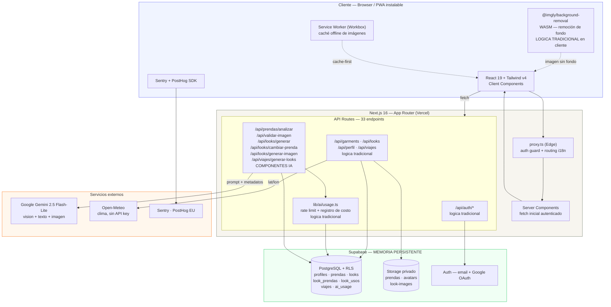
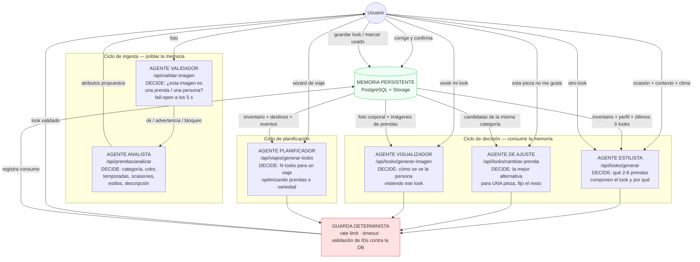
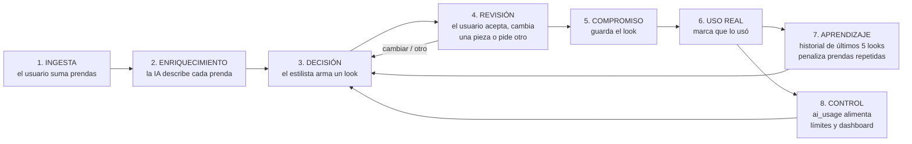
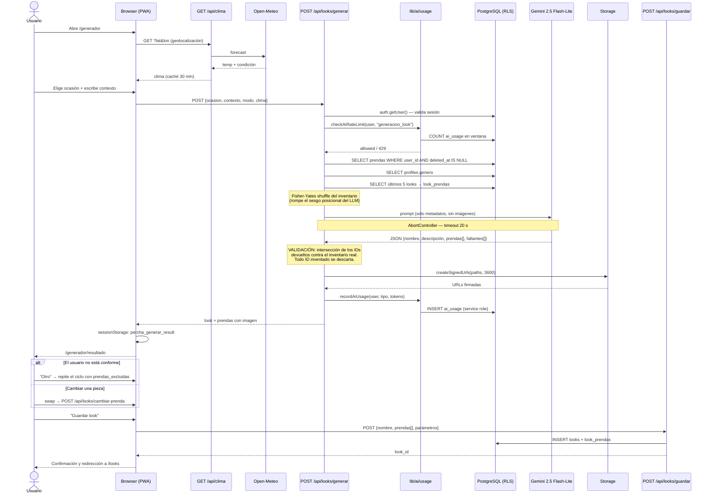
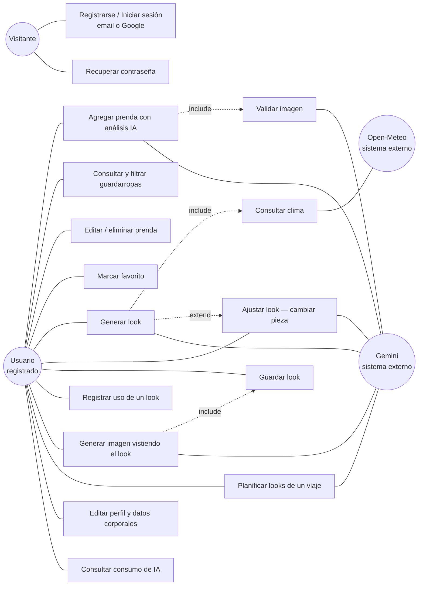

# ENTREGA FINAL DE PROYECTO — Percha

**INTELIGENCIA ARTIFICIAL APLICADA A ORGANIZACIONES**
Universidad Tecnológica Nacional · Facultad Regional Buenos Aires

Autor: **Leonardo Blanco** · Fecha de entrega: _[COMPLETAR]_

---

## LINKS OBLIGATORIOS

> El docente evalúa directamente en estos links. El presente informe es el índice que guía hacia el trabajo publicado.

| Recurso | URL |
|---|---|
| Repositorio GitHub | `https://github.com/leonic15/percha` — _[CONFIRMAR tras el renombrado del repo]_ |
| Aplicación web en producción | _[COMPLETAR — URL de Vercel]_ |
| Video de demo (máx. 3 min) | _[COMPLETAR — YouTube / Drive]_ |
| Documentación técnica del repo | `https://github.com/leonic15/percha/tree/main/docs` |

**Estado de los links al momento de redactar este informe:** pendientes de publicación. Ver [`CHECKLIST-ENTREGA.md`](CHECKLIST-ENTREGA.md) para el detalle de lo que falta publicar y en qué orden.

---

# PARTE 1 — El proyecto como aplicación real

## Sección 1 · Presentación del equipo y del proyecto

### 1.1 Integrantes y roles

| Integrante | Roles asumidos durante el desarrollo |
|---|---|
| **Leonardo Blanco** | Product owner · Arquitecto de software · Desarrollador full-stack · Diseño UX/UI · QA y auditoría de seguridad · Orquestador del co-work con IA |

Proyecto individual. La totalidad del ciclo —desde la definición del problema hasta el despliegue— fue ejecutada por una sola persona, apoyada en un flujo de trabajo de co-work con modelos de IA que se documenta en la Sección 7.

### 1.2 Nombre del proyecto

**Percha** — *Tu guardarropas inteligente.*

Las historias de usuario están numeradas `PERCHA-001` a `PERCHA-036`.

### 1.3 Problema que resuelve

El punto de partida es el mismo declarado en la entrega de medio ciclo:

> Las personas tienen un guardarropas amplio pero **no tienen visibilidad sobre él**. Compran ropa que ya tienen, usan siempre el mismo 20 % de las prendas, y pierden tiempo cada mañana decidiendo qué ponerse. La decisión depende de variables que cambian todos los días —clima, ocasión, qué se usó recientemente— y nadie las cruza mentalmente de forma sistemática.

**Cómo lo resuelve Percha, ya implementado:**

1. **Digitaliza el guardarropas sin trabajo de carga manual.** El usuario saca una foto de la prenda y un modelo de visión la clasifica solo: nombre, categoría, color, temporadas, ocasiones, estilos y una descripción en lenguaje natural. El usuario revisa y corrige, no tipea desde cero.
2. **Genera looks completos cruzando variables reales.** Un agente estilista recibe el inventario del usuario, el clima actual de su ubicación, la ocasión y un contexto libre, y devuelve un outfit coherente construido **solo con prendas que el usuario efectivamente tiene**.
3. **Combate la repetición.** El generador consulta los últimos 5 looks del usuario y penaliza explícitamente las prendas ya usadas, empujando la rotación del guardarropas.
4. **Cierra el ciclo con evidencia visual.** El usuario puede pedir una imagen generada de sí mismo vistiendo el look, a partir de su foto corporal de perfil.
5. **Extiende la decisión al mediano plazo.** El planificador de viajes arma el set completo de looks para un viaje multi-destino, con optimización por cantidad de prendas o por variedad.

### 1.4 Público objetivo

**Usuario primario:** persona de 22 a 45 años, con smartphone como dispositivo principal, guardarropas de entre 30 y 150 prendas, que se viste todos los días para contextos diferenciados (trabajo, salida, deporte, evento) y que **no tiene formación en moda ni interés en aprenderla**.

**Perfil técnico del usuario:** bajo a medio. Usa Instagram, apps de delivery y home banking. **No es un usuario técnico.** Esto condiciona todo el diseño: no se le pide configurar nada, no se le muestra jerga de IA, no se le exponen errores de sistema, y el valor tiene que aparecer en el primer minuto de uso.

**Usuario secundario:** viajero frecuente que necesita resolver el equipaje sin sobre-empacar. Es el caso de uso del planificador de viajes.

**Fuera de alcance deliberado:** estilistas profesionales, e-commerce de moda, comunidad social de outfits. Percha es una herramienta privada de decisión personal, no una red social.

---

## Sección 2 · Arquitectura técnica

### 2.1 Diagrama de arquitectura general

El sistema se organiza en cuatro capas: cliente PWA, aplicación Next.js (Edge + Node), plataforma de datos Supabase y servicios externos de IA/clima.

**Cómo fluyen los datos de entrada a salida.** El usuario aporta dos tipos de entrada: **imágenes** (fotos de prendas y foto corporal) y **parámetros de decisión** (ocasión, contexto libre, ubicación). Las imágenes se comprimen en el cliente, se validan con IA, se les remueve el fondo con WASM local y se suben a Storage privado; sus metadatos derivados por IA se persisten en PostgreSQL. Los parámetros de decisión nunca llegan solos al modelo: se combinan server-side con el inventario del usuario, su perfil y su historial reciente para construir el prompt. La salida es un objeto JSON validado contra la base —el sistema descarta cualquier ID de prenda que el modelo haya inventado— que se materializa como un look con imágenes firmadas y, opcionalmente, como una imagen generada.

**Qué componentes son IA y cuáles son lógica tradicional.**

| Componente | Naturaleza | Detalle |
|---|---|---|
| Validación de imagen subida | **IA** | Gemini decide si la foto es realmente una prenda / una persona de cuerpo entero |
| Análisis de prenda | **IA** | Gemini vision → atributos estructurados |
| Generación de look | **IA** | Gemini texto → selección y justificación |
| Cambio de una prenda del look | **IA** | Gemini texto sobre candidatas filtradas |
| Generación de imagen "vestir mi look" | **IA** | Modelo de imagen de Gemini |
| Planificación de viaje | **IA** | Gemini texto, una llamada para N looks |
| Remoción de fondo | **Tradicional** | ONNX/WASM en el navegador, sin modelo remoto |
| Autenticación y sesiones | **Tradicional** | Supabase Auth + JWT en cookie |
| CRUD, filtros, búsqueda, paginado | **Tradicional** | PostgREST + índices trigram |
| Rate limiting y control de costos | **Tradicional** | Conteo por ventana deslizante sobre `ai_usage` |
| Validación de salida de la IA | **Tradicional** | Set-intersection contra IDs reales del usuario |
| Clima | **Tradicional** | Proxy server-side a Open-Meteo, caché 30 min |

**Dónde vive la memoria persistente.** En PostgreSQL sobre Supabase, con Row Level Security activa en todas las tablas y aislamiento por `user_id`. Se persisten cinco memorias distintas que alimentan las decisiones futuras del sistema:

| Memoria | Tabla | Qué habilita |
|---|---|---|
| Inventario | `prendas` | Es el universo cerrado sobre el que la IA puede decidir |
| Preferencias e identidad | `profiles` | Género, estilos favoritos, ocasiones frecuentes, ciudad, datos corporales |
| Decisiones pasadas | `looks`, `look_prendas` | Historial de outfits y su composición |
| Uso real | `look_usos` | Qué se usó y cuándo — insumo de rotación |
| Consumo de IA | `ai_usage` | Rate limiting, control de costo y dashboard de uso |

Las imágenes viven en Storage privado; nunca se sirven públicamente, siempre por URL firmada de 1 hora o por un proxy autenticado con URL estable (`/api/garments/[id]/image`) que permite cachearlas en el service worker.

### 2.2 Diagrama de flujo de agentes

Percha no usa un framework de orquestación (LangChain, CrewAI). La orquestación es **código propio**: cada agente es una API Route con una responsabilidad acotada, un prompt propio, su propio timeout, su propio límite de uso y su propia validación de salida. El orquestador es el flujo de la aplicación, y el estado compartido vive en PostgreSQL, no en memoria del proceso.

**Qué decide cada agente.**

| Agente | Decisión que toma | Entrada | Salida | Guarda |
|---|---|---|---|---|
| Validador | Si la imagen corresponde al tipo esperado | Imagen base64 + tipo | `valida` / `advertencia` / `rechazo` + motivo | Timeout 5 s → **fail-open** (no bloquea al usuario si la IA falla) |
| Analista | Los atributos de la prenda | Imagen | JSON de 7 campos | Usuario revisa y corrige antes de persistir |
| Estilista | Qué prendas componen el look | Inventario + perfil + clima + ocasión + historial | JSON con IDs, nombre, descripción, faltantes | Timeout 20 s · IDs intersectados contra el guardarropas real |
| Ajuste | La mejor alternativa para una pieza | Hasta 30 candidatas + resto del look | 1 prenda | Timeout 15 s · 422 si no hay alternativas |
| Visualizador | La imagen del usuario vestido | Foto corporal + prendas + escenario | Imagen | Límite duro de 3/día · fallback en cascada de modelos |
| Planificador | El set de looks del viaje | Destinos, fechas, eventos, modo | N looks | Timeout 45 s · una sola llamada para todo el viaje |

**Cómo se comunican.** No se llaman entre sí directamente: **se comunican a través de la memoria persistente y del estado de la sesión del usuario**. El analista escribe atributos en `prendas`; el estilista los lee semanas después. El estilista deja su resultado en `sessionStorage` y en `looks`; el agente de ajuste lo toma de ahí. Esta decisión de diseño es deliberada: evita acoplamiento, permite que cada agente falle de forma aislada sin arrastrar a los demás, y hace que el estado sea inspeccionable en la base en lugar de vivir en la memoria de un proceso serverless.

**El ciclo cíclico de funcionamiento.** El sistema tiene un lazo cerrado de retroalimentación:

El lazo **7 → 3** es el que hace que el sistema mejore con el uso: cuanto más lo usa la persona, más sabe Percha qué se puso recientemente, y más rota el guardarropas en lugar de repetir. El lazo **8 → 3** es el control de costos: cada decisión de IA consume presupuesto y ese consumo condiciona las decisiones siguientes.

### 2.3 UML — Diagrama de secuencia

Interacción completa: **generar un look desde cero**, desde que el usuario abre el generador hasta que guarda el resultado.

### 2.4 UML — Diagrama de casos de uso

> Los diagramas de clases/entidades y el detalle completo del modelo de datos están en el **Anexo A**.

---

## Sección 3 · Stack tecnológico

| Componente | Tecnología / Herramienta | Por qué se eligió esta y no otra |
|---|---|---|
| **Frontend** | Next.js 16.2.6 (App Router) + React 19.2.4 + TypeScript 5 + Tailwind CSS v4 | Se necesitaba un solo proyecto que fuera **frontend y backend a la vez**: las API keys de IA no pueden vivir en el cliente, así que hacía falta un servidor. Next.js resuelve ambas cosas con Server Components y API Routes en el mismo repositorio, sin mantener dos deploys. Se descartó React puro + backend separado por el costo de mantener dos proyectos siendo una sola persona; se descartó Flutter porque la distribución por stores agregaba fricción innecesaria frente a una PWA instalable. Tailwind v4 se eligió por sus tokens en `@theme {}`, que permitieron traducir el design system del handoff a CSS sin archivo de configuración intermedio. |
| **Backend** | API Routes de Next.js sobre Node.js (33 endpoints) + `proxy.ts` en Edge Runtime | Mismo argumento que arriba: **cero infraestructura adicional**. Se descartó Python FastAPI —que hubiera sido más idiomático para IA— porque obligaba a un segundo deploy, a duplicar la validación de sesión y a manejar CORS. Como las llamadas a Gemini son HTTP REST planas, no se pierde nada por no usar el SDK de Python. El middleware corre en Edge para que el guard de autenticación y el ruteo i18n no paguen cold start de Node. |
| **Base de datos** | Supabase — PostgreSQL 15 + Storage + Auth | Se eligió por la combinación **Postgres real + RLS + Auth + Storage privado en un solo servicio**. RLS fue determinante: la política de aislamiento por `user_id` vive en la base, no en el código, así que un bug en una API Route no puede filtrar datos de otro usuario. Se descartó Firebase por ser NoSQL —el modelo tiene relaciones N:M claras entre looks y prendas, que en Firestore hubieran obligado a desnormalizar— y SQLite por no resolver ni auth ni storage ni acceso concurrente. |
| **Modelo de IA** | Google Gemini 2.5 Flash-Lite (visión, texto y generación de imagen) | Es el punto de decisión más importante del proyecto. Se eligió por tres razones: (1) **multimodal nativo** — el mismo modelo analiza fotos de prendas y razona sobre texto, sin integrar dos proveedores; (2) **costo por token sustancialmente menor** que GPT-4o o Claude Sonnet, algo crítico porque cada uso de la app dispara al menos una llamada y el proyecto corre sobre tiers gratuitos; (3) **latencia** — Flash-Lite responde la generación de un look en pocos segundos, y por encima de ~20 s el usuario abandona el flujo. Se descartó GPT-4o por costo, y un modelo local por no poder correr en el runtime serverless de Vercel (ver Parte 2). |
| **Orquestación** | **Código propio** — API Routes especializadas + `lib/ai/usage.ts` como guarda transversal | Se evaluó LangChain y se descartó deliberadamente. Los agentes de Percha son de un solo paso —una llamada, un JSON, una validación— sin necesidad de ReAct, memoria conversacional ni tool-calling autónomo. LangChain hubiera agregado una capa de abstracción, dependencias pesadas en un bundle serverless y opacidad sobre el prompt exacto que se envía, a cambio de nada. La orquestación real que sí hacía falta —rate limiting, timeouts, registro de costo y validación de salida contra la base— **ningún framework la resuelve**, y está implementada a mano en 100 líneas. |
| **Despliegue** | Vercel (free tier, región `gru1` São Paulo) + GitHub Actions para CI | Deploy nativo de Next.js sin configuración, preview por pull request y funciones serverless con `maxDuration` ajustable por ruta (30 s general, 60 s para generación de imagen). Región São Paulo por cercanía a usuarios en Argentina. CI en GitHub Actions corre `lint` + `typecheck` + `build` en cada push. |
| **Almacenamiento de imágenes** | Supabase Storage — buckets privados con políticas por carpeta | Ninguna imagen es pública. Se sirven por URL firmada de 1 hora o por proxy autenticado con URL estable, para que el service worker pueda cachearlas. |
| **PWA / offline** | `@ducanh2912/next-pwa` (Workbox) | Instalable en el home screen sin pasar por stores. Estrategia `StaleWhileRevalidate` sobre las imágenes de prendas: el guardarropas se ve al instante en visitas repetidas. |
| **Procesamiento de imagen en cliente** | `browser-image-compression` + `@imgly/background-removal` (ONNX/WASM) | La compresión antes de subir reduce costo de transferencia y de tokens. La remoción de fondo corre **en el dispositivo del usuario**: es la pieza de IA que ya es local en Percha, y no cuesta nada por uso ni envía la imagen a un tercero. |
| **Internacionalización** | `next-intl` v4 — `es` (default, sin prefijo) / `en` | Requisito de accesibilidad idiomática desde el diseño. Todo el texto de interfaz sale de archivos de mensajes, no está hardcodeado. |
| **Observabilidad** | Sentry (cliente + servidor + edge) + logger JSON estructurado | Necesario para diagnosticar fallas de IA en producción sin poder reproducirlas localmente. |
| **Analytics** | PostHog Cloud EU | Región EU por criterio de privacidad. **Nunca se envían email ni nombre**; el `user_id` viaja hasheado con SHA-256. |
| **Validación de datos** | Zod v4 | Validación de payloads en el borde de cada API Route, con inferencia de tipos hacia TypeScript. |

---

## Sección 4 · Evidencia de funcionamiento

### 4.1 Capturas de pantalla

> **Estado:** pendientes de captura. Ver [`CHECKLIST-ENTREGA.md`](CHECKLIST-ENTREGA.md). Las capturas van en `docs/entrega-final/capturas/` y se referencian desde acá.

| # | Pantalla | Qué evidencia | Archivo |
|---|---|---|---|
| 1 | Guardarropas (home autenticado) | Pantalla principal: grilla de prendas reales, chips de categoría, filtros, contador | `capturas/01-guardarropas.png` |
| 2 | Agregar prenda — paso 1 (captura) | Inicio del flujo de valor: dropzone, cámara/galería | `capturas/02-agregar-captura.png` |
| 3 | Agregar prenda — paso 2 (analizando) | **IA trabajando visible**: overlay de escaneo + pasos de progreso | `capturas/03-agregar-analizando.png` |
| 4 | Agregar prenda — paso 3 (formulario) | **Output de IA visible**: campos pre-llenados con badges "IA" que desaparecen al editar | `capturas/04-agregar-formulario.png` |
| 5 | Generador — configuración | Widget de clima real + chips de ocasión + contexto libre | `capturas/05-generador-config.png` |
| 6 | Generador — resultado | **Output principal de IA**: nombre del look, descripción del estilista, prendas seleccionadas, faltantes | `capturas/06-generador-resultado.png` |
| 7 | Detalle de prenda | Descripción generada por IA sobre la prenda | `capturas/07-detalle-prenda.png` |
| 8 | Vestir mi look | Imagen generada del usuario con el outfit puesto | `capturas/08-vestir-look.png` |
| 9 | Planificador de viajes | Set de looks generados para un viaje multi-destino | `capturas/09-viaje.png` |
| 10 | Perfil — consumo de IA | Dashboard de uso: barras por tipo de operación contra el límite diario | `capturas/10-uso-ia.png` |

El **flujo de uso principal** —el camino desde que el usuario entra hasta que obtiene valor— corresponde a la secuencia **1 → 2 → 3 → 4 → 5 → 6**: entra a su guardarropas, suma una prenda que la IA clasifica sola, pide un look y recibe un outfit armado con su propia ropa.

### 4.2 Video de demostración

**Estado:** pendiente de grabación. Guion propuesto de 3 minutos en el [Anexo D](anexos/D-guion-video.md).

### 4.3 Log de una sesión real

Se registra una ejecución completa del sistema con datos reales de un guardarropas cargado, no de prueba. El log incluye la traza de una generación de look de punta a punta: request del cliente, consultas a la base, prompt efectivo enviado a Gemini, respuesta cruda del modelo, validación de IDs, y registro en `ai_usage`.

**Ver [Anexo C — Log de sesión real](anexos/C-log-sesion-real.md).**

Evidencia complementaria disponible en la propia aplicación:

- **Dashboard de consumo de IA** (`/perfil`, endpoint `GET /api/perfil/uso-ia`): muestra en vivo cuántas operaciones de cada tipo consumió el usuario en las últimas 24 horas contra su límite. Es la vista de usuario de la tabla `ai_usage`.
- **Tabla `ai_usage` en Supabase**: una fila por cada llamada a IA, con tipo, tokens consumidos y costo estimado.
- **Sentry y PostHog**: trazas de error y eventos de producto de sesiones reales.

### 4.4 Evidencia de proceso: el repositorio

El repositorio es en sí mismo evidencia del proceso de trabajo:

| Métrica | Valor |
|---|---|
| Commits | 41, distribuidos entre el 22/05/2026 y el 06/08/2026 |
| Pull requests mergeados | 7 (rama `implement` → `main`) |
| Historias de usuario documentadas | 36 (`docs/stories/PERCHA-001` a `PERCHA-036`) |
| API Routes | 33 |
| Páginas de aplicación | 23 |
| Migraciones de base de datos | 9, versionadas y reproducibles con `npm run db:reset` |
| Documentación técnica | Arquitectura, schema, convenciones, estructura, ADRs, auditoría |

---

## Sección 5 · Evaluación UX/UI

### 5.1 Heurísticas de Nielsen aplicadas al proyecto

Evaluación de las 10 heurísticas contra el sistema implementado. La versión extendida, con la evidencia de código de cada fila, está en el [Anexo B](anexos/B-heuristicas-nielsen.md).

| Heurística | ¿Cumple? | Evidencia / Observación |
|---|---|---|
| **1. Visibilidad del estado del sistema** | **Sí** | Cada operación de IA tiene su propio estado visible: el paso 2 de agregar prenda muestra un overlay de escaneo con pasos de progreso reales; el generador muestra un spinner con mensajes que cambian; "vestir mi look" tiene un overlay dedicado con dots animados. Los toggles de favorito son optimistas con revert visible si el servidor falla. El perfil expone un dashboard de consumo de IA con barras contra el límite diario. |
| **2. Coincidencia con el mundo real** | **Sí** | El vocabulario es el del usuario, no el del sistema: "guardarropas", "prendas", "looks", "ocasión", "temporada". Nunca aparece "modelo", "prompt", "token" ni "inferencia". La IA describe las prendas con terminología ajustada al género del perfil ("remera/pantalón" vs "blusa/vestido"), instrucción explícita en el prompt del estilista. La app está en español rioplatense por defecto. |
| **3. Control y libertad del usuario** | **Sí** | El usuario **nunca queda atrapado en la decisión de la IA**: puede pedir otro look, cambiar una sola pieza sin perder el resto, excluir prendas de la próxima generación, y editar cualquier atributo que la IA propuso antes de guardar. La eliminación de prendas es **soft-delete** (`deleted_at`), no destructiva. Los bottom sheets de filtros usan estado pendiente con commit/descarte explícito. |
| **4. Consistencia y estándares** | **Sí** | Design system único con tokens en `@theme {}`: una sola escala tipográfica, un radio de botón pill, una sombra de card, un color de acento. Todos los sheets entran con la misma animación de 280 ms. Navegación consistente: bottom nav en mobile, sidebar de 240 px en desktop, en todas las pantallas de la app. |
| **5. Prevención de errores** | **Sí** | Es donde más se invirtió. **Antes** de gastar una llamada cara, un agente validador chequea que la foto sea realmente una prenda o una persona de cuerpo entero, y bloquea o advierte según el caso. Las imágenes se comprimen y se valida su tamaño antes de subirlas. Las acciones destructivas piden confirmación en un bottom sheet. Los límites de uso de IA se comunican **antes** de que el usuario los alcance, en el dashboard de consumo. El prompt del estilista incluye reglas de composición explícitas para prevenir errores del propio modelo (no dos pantalones, no abrigo sin prenda base debajo). |
| **6. Reconocimiento sobre recuerdo** | **Sí** | Todo se elige, nada se recuerda: ocasiones y categorías son chips visibles, los colores se eligen de una paleta de 12 muestras, el picker de prenda base es una grilla de fotos con búsqueda. El detalle de prenda muestra "Agregada" y "Último uso" para no exigir memoria. El formulario post-análisis llega pre-llenado. |
| **7. Flexibilidad y eficiencia de uso** | **Parcial** | A favor: dos modos de generación (desde cero / con prenda base), toggle grilla-lista, filtros persistentes, PWA instalable con caché de imágenes, dos idiomas. En contra: **no hay atajos para usuarios expertos** —no se pueden guardar combinaciones de filtros favoritas, ni repetir un look pasado con un toque, ni hay carga masiva de prendas—. La carga inicial del guardarropas sigue siendo prenda por prenda, que es la fricción más alta del producto. |
| **8. Diseño estético y minimalista** | **Sí** | Una acción primaria por pantalla, jerarquía tipográfica marcada (H1 de 32-36 px contra cuerpo de 14 px), paleta reducida a crema, verde oliva de acento y neutros. La foto de la prenda es el elemento dominante en el detalle. Los badges de "IA" desaparecen apenas el usuario edita el campo: la marca de origen se retira cuando deja de ser cierta. |
| **9. Ayuda para reconocer y recuperarse de errores** | **Parcial** | A favor: todos los errores se traducen a lenguaje humano y accionable —el rate limit dice "Alcanzaste el límite de 3 imágenes por día. Volvé mañana", no un 429; el guardarropas vacío dice qué hacer; el validador explica por qué rechazó la foto; los fallos de IA se recuperan con reintento explícito—. Nunca se muestra un stack trace. En contra: **algunos errores de red se resuelven con un toast genérico** sin ofrecer reintento en el lugar, y no hay recuperación automática de un formulario perdido por un fallo de conexión. |
| **10. Ayuda y documentación** | **Parcial** | A favor: la interfaz es autoexplicativa por diseño y los estados vacíos funcionan como onboarding contextual; el `README` documenta el proyecto completo para un desarrollador. En contra: **no hay ayuda in-app para el usuario final** —no hay onboarding de primera vez, ni FAQ, ni explicación de qué hace la IA con sus fotos accesible desde la app—. Es la brecha más clara detectada en esta evaluación. |

**Resultado: 7 heurísticas cumplidas, 3 parciales, 0 incumplidas.** Las tres parciales (7, 9 y 10) coinciden en un patrón: el producto está optimizado para el **primer uso** y para el **camino feliz**, y menos para el usuario recurrente y para la recuperación de fallas. Es una consecuencia razonable de haber priorizado tener el ciclo completo funcionando, y es el foco natural de la siguiente iteración.

### 5.2 Evaluación orientada al público objetivo

**¿El diseño es apropiado para el nivel técnico del usuario final?**

Sí, y es el criterio que más condicionó decisiones de producto. El usuario objetivo —bajo perfil técnico, mobile-first— nunca es expuesto a la mecánica del sistema. Evidencia concreta:

- **No configura nada.** No elige modelo, no ajusta parámetros, no ve un campo de "prompt". Lo único que escribe es un texto libre opcional en lenguaje natural ("cena con amigos, hace frío").
- **No carga datos estructurados.** La tarea más tediosa —clasificar una prenda en categoría, color, temporada, ocasión y estilo— la hace la IA a partir de una foto. El usuario **revisa**, que es cognitivamente mucho más barato que **completar**.
- **No ve errores de sistema.** Ningún código HTTP, ningún nombre de excepción, ningún stack trace llega a la interfaz.
- **No pierde datos por equivocarse.** La eliminación es soft-delete y las acciones destructivas se confirman.
- **Mobile-first real, no adaptado.** Áreas táctiles de 44 px o más, FAB a 20 px del borde derecho y 108 px del inferior, bottom nav fija, bottom sheets en lugar de modales centrados. La PWA se instala en el home screen sin pasar por una store.

**¿El lenguaje visual y textual es comprensible para ese usuario?**

Sí. El vocabulario es el del dominio cotidiano de la ropa, no el del software (heurística 2). El lenguaje visual apoya la comprensión: la foto de la prenda siempre domina sobre el texto, los estados se comunican con movimiento antes que con texto, y **el origen de cada dato es visible** —los campos que propuso la IA llevan un badge que desaparece apenas el usuario los edita—. Esto último resuelve una pregunta que el usuario no técnico sí se hace: *"¿esto lo puse yo o lo puso la máquina?"*.

La única deuda de lenguaje detectada: el término "look" es entendible pero no es universal en todos los registros; alguna persona podría esperar "outfit" o "conjunto". No se cambió porque "look" es el término más usado en el español rioplatense del público objetivo.

**¿Se hizo alguna prueba con un usuario real? ¿Qué feedback se obtuvo?**

Sí, pruebas informales de uso real durante el desarrollo, sobre dispositivo físico (iPhone en red local) y no solo en emulador. No fue un test de usabilidad formal con protocolo y métricas; fueron sesiones de observación de uso. El feedback que efectivamente cambió el producto:

| Feedback observado | Cambio implementado |
|---|---|
| "Me arma siempre el mismo look" — el modelo tendía a elegir las mismas prendas por sesgo posicional del prompt | Se agregó un **shuffle Fisher-Yates** del inventario antes de construir el prompt, y una sección de **prendas usadas en los últimos 5 looks** que el prompt instruye a no repetir. |
| "Me puso dos pantalones" / "me puso una campera sin nada abajo" | Se agregaron **reglas de composición explícitas** al prompt del estilista (parte inferior obligatoria, abrigo siempre con prenda base debajo, prohibición de dos prendas del mismo grupo). |
| "Le saqué una foto a la pared y me la cargó como prenda" | Se implementó el **agente validador de imagen** (`PERCHA-036`), con bloqueo para casos claros y advertencia no bloqueante para casos dudosos. |
| "En el celular las fotos no cargan" (durante pruebas en red local) | Se diagnosticó un problema de subrecursos de `/public` bajo Turbopack en LAN y se resolvió con una API route de imágenes y ajuste de `allowedDevOrigins` y de la CSP. |
| "Tarda y no sé si está haciendo algo" | Se implementaron overlays de progreso con pasos reales en los tres flujos de IA más lentos. |
| "Me habla en femenino y soy hombre" | Se incorporó el **género del perfil al prompt**, con instrucción explícita de terminología. |

Este ciclo —observar uso real, detectar la falla, corregir el prompt o la guarda determinista, volver a probar— es la evidencia más fuerte de que la evaluación de UX no fue un ejercicio de escritorio.

---

## Sección 6 · Evaluación de Ciberseguridad

Se realizó una **auditoría estática completa de seguridad y performance** el 30/05/2026, documentada en [`docs/auditoria-seguridad-performance.md`](../auditoria-seguridad-performance.md). Alcance: las 33 API Routes, el middleware, los clientes de Supabase, las migraciones y políticas RLS, la configuración de Next.js, el CI y el manejo de secretos y logs.

**Resultado: 17 hallazgos — 3 críticos, 7 medios, 7 bajos. Los 17 fueron remediados.**

No se trató de un pentest activo: fue revisión de código y de configuración, con verificación de la corrección en el repositorio.

### Log de consideraciones de seguridad

| # | Riesgo identificado | Tipo | Medida implementada o decisión tomada |
|---|---|---|---|
| 1 | **Inyección de prompt en el modelo de IA** — el usuario controla el campo "contexto" libre y podría intentar redirigir el comportamiento del estilista | Prompt injection (OWASP LLM01) | **Defensa en la salida, no en la entrada.** Se asume que el prompt puede ser manipulado y se blinda el resultado: los IDs de prenda que devuelve el modelo se **intersectan contra el inventario real del usuario** y todo ID inventado se descarta silenciosamente. La respuesta se parsea con extracción de JSON acotada y cualquier texto fuera del objeto se ignora. El modelo nunca recibe credenciales, nunca puede ejecutar acciones, y su salida jamás se usa como identificador sin validar. Además el contexto libre está acotado en longitud y el resto del prompt es fijo y server-side. |
| 2 | **Exposición de API keys** — `GEMINI_API_KEY` y `SUPABASE_SERVICE_ROLE_KEY` | Secretos en código (OWASP A05) | Ambas viven **solo server-side**, sin prefijo `NEXT_PUBLIC_`, y solo se usan dentro de API Routes. `.env.local` está en `.gitignore`; el repositorio versiona únicamente `.env.example` con nombres y descripciones, sin valores. Se corrió un audit de secretos como parte de `PERCHA-029`. Hallazgo **H-11** de la auditoría: la key de Gemini viajaba en query string (`?key=`) donde podía quedar en logs intermedios; se corrigió pasándola por header. |
| 3 | **Datos de usuarios almacenados** — fotos de ropa, foto corporal de cuerpo entero, ubicación, datos corporales | Privacidad | **Se guarda:** las imágenes en buckets **privados** con políticas por carpeta `{user_id}/`, servidas solo por URL firmada de 1 hora o por proxy autenticado; los metadatos de prendas y looks; el perfil. **No se guarda:** ninguna imagen es pública, ni indexable, ni compartible por link permanente. **No se envía a terceros:** a PostHog nunca se manda email ni nombre, y el `user_id` viaja **hasheado con SHA-256**, nunca el UUID real. PostHog está en región **EU**. La remoción de fondo corre en el navegador del usuario (WASM), así que esa imagen no sale del dispositivo para ese procesamiento. Las eliminaciones son soft-delete, recuperables. |
| 4 | **Acceso no autorizado a datos de otro usuario** | Autenticación / Control de acceso (OWASP A01) | **Se implementó, en tres capas.** (a) Supabase Auth con JWT en cookie httpOnly y refresh de sesión en el middleware Edge. (b) **Row Level Security activa en todas las tablas** con aislamiento por `user_id`: la política vive en la base, de modo que un bug en una API Route no alcanza para filtrar datos ajenos. (c) Storage con políticas por carpeta. Toda API Route valida `auth.getUser()` antes de operar. La migración `20260527000000_fix_looks_rls.sql` corrige específicamente una política de looks detectada como insuficiente. |
| 5 | **DoS económico sobre la API de IA** — un usuario autenticado invocando endpoints de Gemini en bucle | Abuso de recursos / Costos (OWASP LLM10) | **Hallazgo crítico H-03, remediado.** Se implementó rate limiting por usuario y por tipo de operación en `lib/ai/usage.ts`, con ventanas deslizantes contadas sobre `ai_usage`, aplicado **antes** de la llamada cara: análisis de prenda 15/min y 200/día; generación de look 10/min y 120/día; viaje 5/min y 40/día; cambio de prenda 15/min y 200/día; **generación de imagen 3/día** (la operación más cara); validación de imagen 30/min y 300/día. Devuelve `429` con `Retry-After` y un mensaje humano. El limiter es **fail-open**: si falla la infraestructura del propio limiter, no bloquea al usuario. |
| 6 | **Rate limit evadible y costos no registrados** | Control de acceso a nivel de datos | **Hallazgo crítico H-01, remediado.** Los `INSERT` en `ai_usage` se hacían con el cliente de usuario contra una tabla cuya RLS **no tenía política de INSERT**: se rechazaban en silencio, el conteo diario daba siempre 0 y el límite de imágenes nunca se aplicaba. Se centralizó en `recordAiUsage()` usando **service role**, con chequeo y log del error, y se instrumentaron las 6 rutas de IA. |
| 7 | **Endpoint de diagnóstico expuesto sin autenticación** | Exposición de información (OWASP A01) | **Hallazgo crítico H-02, remediado.** `/api/auth/debug` devolvía configuración de entorno a cualquiera, sin validar sesión, y el middleware excluye `/api/*`. Se **eliminó el archivo**. Se incorporó a la checklist de release verificar que no queden endpoints de debug. |
| 8 | **Inyección de filtros PostgREST** en el parámetro de búsqueda `q` | Inyección (OWASP A03) | **Hallazgo H-04, remediado.** El endpoint `GET /api/garments` interpolaba `q` directamente dentro de `.or()`, permitiendo inyectar sintaxis de filtro de PostgREST. Se saneó la entrada. |
| 9 | **Cross-site scripting y clickjacking** | OWASP A03 / A05 | Cabeceras de seguridad en todas las rutas: **CSP** sin `unsafe-eval` en todo el sitio salvo la única ruta que carga WASM de Emscripten, `X-Frame-Options: DENY`, `X-Content-Type-Options: nosniff`, `Referrer-Policy: strict-origin-when-cross-origin`, `Permissions-Policy` restrictiva (cámara y geolocalización solo `self`, micrófono deshabilitado) y **HSTS con preload**. `frame-src`, `object-src` en `none`; `base-uri` y `form-action` en `self`. Hallazgo **H-05**: se eliminó `unsafe-eval` de la CSP global, aislándolo a una sola ruta. |
| 10 | **Agotamiento de memoria por subidas sin límite** | DoS / Recursos | **Hallazgos H-06 y H-07, remediados.** `POST /api/validar-imagen` aceptaba base64 en JSON sin tope y las subidas leían el archivo completo a memoria con `arrayBuffer()` antes de validar tamaño. Se agregaron límites de tamaño previos al buffering. |
| 11 | **Enumeración de usuarios en autenticación** | Autenticación | Los endpoints de auth devuelven respuestas genéricas que no permiten distinguir "email inexistente" de "contraseña incorrecta". La recuperación de contraseña responde igual exista o no la cuenta. |
| 12 | **Redirección abierta en el callback de OAuth** | OWASP A01 | **Hallazgo H-12, remediado.** El parámetro `next` del callback no se validaba; se exige que empiece con `/` para impedir redirección a dominio externo. |
| 13 | **Fuga de datos por logs y telemetría** | Privacidad / Observabilidad | El `user_id` se hashea con SHA-256 en logs y analytics. Se usa un logger JSON estructurado en lugar de `console.*` (**H-15**). Sentry recibe errores, no payloads de usuario. |
| 14 | **Secretos y binarios versionados en el repositorio** | Higiene del repositorio | **Hallazgo H-09, remediado.** Se detectaron `.codegraph/*.db` y un tarball de Playwright trackeados pese a estar en `.gitignore`; se removieron del índice y se corrigió el ignore. |
| 15 | **Confianza en el MIME declarado por el cliente** | Validación de entrada | **Hallazgo H-17, remediado.** Se validaba solo el `mime` enviado por el cliente, sin verificar el contenido real del archivo. Se agregó validación de extensión y contenido. |
| 16 | **Integridad transaccional en creación de viajes** | Integridad de datos | **Hallazgo H-08, remediado.** `POST /api/viajes` insertaba sin transacción y sin verificar que las `prenda_id` referenciadas pertenecieran al usuario. Se agregó la verificación de pertenencia. |

**Riesgo residual asumido y declarado.** El rate limiting cuenta filas en PostgreSQL, no usa un almacén dedicado tipo Redis: bajo alta concurrencia real podría haber una ventana de carrera que permita algunas llamadas de más. Se aceptó conscientemente porque el objetivo es frenar bucles de abuso y contener costo, no garantizar una cuota exacta, y porque agregar Redis contradecía la restricción de infraestructura cero del proyecto. Queda documentado como deuda si el volumen lo justifica.

---

## Sección 7 · IAs usadas en el co-work de desarrollo

| Herramienta IA | Para qué se usó | Aportó bien / mal / sorprendió |
|---|---|---|
| **Claude (Claude Code)** | Herramienta central del proyecto. Implementación de las API Routes, migraciones SQL con RLS, componentes React, refactors, la **auditoría de seguridad y performance completa** (17 hallazgos) y su remediación, y la redacción de la documentación técnica del repositorio. | **Aportó muy bien.** El diferencial no fue generar código suelto sino **operar sobre el repositorio completo**: leer el código existente, encontrar la inconsistencia y aplicar el cambio en todos los archivos afectados. La auditoría de seguridad es el mejor ejemplo: encontró H-01 —los `INSERT` en `ai_usage` rechazados silenciosamente por RLS, que dejaban el límite de imágenes en cero— un bug que **no producía ningún error visible** y que una revisión manual difícilmente habría detectado. **Sorprendió** que rastreara la consecuencia funcional (el límite diario nunca se aplica) partiendo de una política de base de datos faltante. |
| **Claude Design** | Generación del design system y del prototipo visual interactivo de las 16 pantallas, que funcionó como fuente autoritativa de diseño (`docs/design/Handoff.html`). | **Aportó muy bien.** Tener un prototipo navegable **antes** de escribir componentes evitó rediseñar sobre código ya escrito. Los tokens salieron del prototipo directo a `@theme {}` de Tailwind v4. |
| **Google Gemini** | Doble rol: es el **modelo en producción** de la aplicación (visión, texto e imagen) y se usó también para iterar y refinar los prompts de los agentes. | **Aportó bien en producción, con matices.** Muy buena relación costo/latencia. **Aportó mal** en dos cosas concretas que obligaron a construir defensas: (a) **sesgo posicional** —tendía a elegir las primeras prendas de la lista, resuelto con shuffle Fisher-Yates—; (b) **incoherencia de composición** —armaba looks con dos pantalones o con campera sin prenda base debajo, resuelto con reglas explícitas en el prompt—. También **alucinaba IDs de prenda** ocasionalmente, lo que motivó la validación por intersección contra la base. |
| **ChatGPT** | Consultas puntuales de contraste sobre decisiones de arquitectura y alternativas de stack. | Aportó como segunda opinión en decisiones acotadas. Uso marginal frente a las anteriores. |

### Reflexión

**¿Qué parte del desarrollo hubiera sido imposible o hubiera tomado el doble de tiempo sin el co-work con IA?**

Tres cosas, en orden de impacto. La primera es la **auditoría de seguridad**: 17 hallazgos sobre 33 endpoints, migraciones, CSP, manejo de secretos y logs, con la remediación de cada uno. Una persona sola, sin formación específica en seguridad, no llega a ese nivel de cobertura en el tiempo disponible —y muy probablemente nunca hubiera encontrado H-01, porque era un bug silencioso que no rompía nada visible mientras dejaba el control de costos completamente inoperante. La segunda es el **volumen de superficie construida**: 33 endpoints, 23 pantallas, 9 migraciones con RLS y dos idiomas, en once semanas, siendo una sola persona que además hizo el diseño y el producto. La tercera, menos obvia, es la **documentación**: arquitectura con diagramas, schema, convenciones, ADRs y 36 historias de usuario. En un proyecto individual la documentación es lo primero que se sacrifica; acá existe, y es lo que hace que el repositorio sea evidencia del proceso y no solo un volcado de código.

**¿Qué parte la IA hizo mal y hubo que corregir?**

Dos categorías, y la distinción importa.

La primera es la IA **como asistente de desarrollo**. Su punto débil sistemático fue asumir APIs que ya no existen. El proyecto corre sobre Next.js 16, donde `middleware.ts` pasó a llamarse `proxy.ts` y exporta `proxy()` en lugar de `middleware()`, y sobre Tailwind v4, que reemplaza `tailwind.config.js` por tokens en `@theme {}`. El modelo generaba repetidamente la versión anterior de ambas cosas, con el patrón conocido: código que *parece* correcto y falla en runtime. La corrección no fue puntual sino **estructural**: se agregaron instrucciones permanentes al repositorio (`AGENTS.md`, `CLAUDE.md`) obligando a leer la documentación local de la versión instalada antes de escribir código, y `.claude/PROJECT.md` con las convenciones no negociables del stack. También hubo que corregir tendencias a sobre-ingeniería —proponer abstracciones para casos que no existían— y una inclinación a "arreglar" tests o validaciones en lugar de arreglar la causa.

La segunda es la IA **como componente de producto**, y ahí el aprendizaje fue más profundo: **el modelo no es confiable como fuente de verdad, y hay que diseñar asumiendo que va a fallar**. Gemini alucinaba IDs de prendas que no existían, elegía por posición en la lista en vez de por criterio, y armaba outfits físicamente incoherentes. Ninguno de esos problemas se resolvió "mejorando el prompt" solamente. Se resolvieron con **guardas deterministas alrededor del modelo**: intersección de IDs contra la base de datos, shuffle previo del inventario, reglas de composición explícitas, timeouts con `AbortController`, rate limiting antes de la llamada, y política de *fail-open* en el validador para que una falla de IA nunca bloquee al usuario. Esa es la conclusión más transferible del proyecto: **el valor de ingeniería en una aplicación con IA no está en el prompt, está en la capa determinista que lo rodea.**

---

# PARTE 2 — IA local en el proyecto

## 1. ¿Qué papel jugaría un LLM/SLM local en Percha?

Hoy Percha depende de una API externa para **seis** operaciones distintas, y **una sola de ellas ya corre localmente**: la remoción de fondo de las prendas se ejecuta como modelo ONNX en el navegador del usuario vía WASM, sin salir del dispositivo y sin costo por uso. Ese precedente es importante, porque demuestra que la arquitectura ya admite inferencia local sin romper el flujo.

**Qué reemplazaría un SLM local.** El candidato inmediato y más claro es el **agente validador de imagen**. Hoy consume una llamada a Gemini solo para responder una pregunta binaria —"¿esto es una prenda de ropa, sí o no?"—, que es la tarea de menor exigencia cognitiva de todo el sistema y, sin embargo, es la que más se ejecuta: se dispara en **cada** intento de carga, incluidos los que terminan rechazados. Un modelo de visión pequeño (LLaVA-Phi3, Moondream2, o Gemma 3 4B multimodal) resuelve esa clasificación con calidad suficiente. El impacto es doble: elimina un costo que hoy se paga por trabajo descartado y **corta la latencia del paso más frustrante del flujo**, porque el usuario que sube una foto equivocada hoy espera una llamada de red completa para enterarse.

El segundo candidato es el **enriquecimiento de metadatos de prenda** en su parte estructurada: categoría, color dominante y temporada son atributos que un SLM resuelve razonablemente. La descripción en lenguaje natural —la parte que el usuario efectivamente lee y valora— convendría dejarla en el modelo grande.

**Qué haría de nuevo, que hoy no se puede hacer.** Acá está lo más interesante, y no es un reemplazo sino una **capacidad nueva bloqueada por costo**. Hoy cada generación de look es una transacción cara y limitada por cuota: por eso el sistema pide parámetros explícitos y genera **un** look. Con un modelo local y costo marginal cero por inferencia se abre un modo distinto: **generación proactiva y anticipada**. Percha podría precomputar durante la noche los tres looks del día siguiente cruzando el pronóstico del clima con la agenda del usuario, y presentarlos ya listos al despertar, en lugar de esperar a que se los pidan. Ese producto es imposible hoy: dispararía el costo por usuario y agotaría la cuota en días. Con inferencia local, el costo de "probar 20 combinaciones y quedarse con las 3 mejores" es simplemente tiempo de CPU ocioso.

**¿Agente principal, subagente o soporte?** La respuesta honesta es **arquitectura híbrida por costo-calidad, no reemplazo total**. El SLM local sería un **subagente de primera línea**: resuelve las tareas de alto volumen y baja complejidad —validación, clasificación, filtrado de candidatas, pre-selección— y solo escala al modelo grande cuando la tarea requiere razonamiento estético real o texto que el usuario va a leer. Un enrutador simple decide, por tipo de operación y por confianza del modelo local, si la respuesta local alcanza o si hay que pagar la llamada externa. En la práctica esto reduciría fuertemente el tráfico a la API sin degradar la parte del producto que el usuario percibe como valiosa.

**El obstáculo real, dicho sin adornos:** Percha corre en **funciones serverless de Vercel**, que no admiten cargar y mantener en memoria un modelo de varios gigabytes entre invocaciones. Adoptar un SLM local implica una de tres decisiones de infraestructura, cada una con su costo: (a) llevar la inferencia al **dispositivo del usuario**, extendiendo el precedente de WASM que ya existe —el camino más coherente con el producto y con la privacidad, limitado por el hardware del celular—; (b) montar un **servidor propio con Ollama** y salir del modelo serverless, asumiendo costo fijo mensual y operación; (c) usar un **proveedor de modelos abiertos alojados** (Groq, Together), que baja el costo pero no da privacidad ni offline, con lo cual pierde el punto.

## 2. ¿Qué le aportaría al usuario de la aplicación?

**Privacidad, y no es un argumento abstracto en este producto.** Percha maneja el tipo de dato más sensible que puede manejar una app de ropa: **una foto de cuerpo entero del usuario**, que la funcionalidad "vestir mi look" necesita para generar la imagen del outfit puesto. Hoy esa foto se envía a un tercero. Es, con mucha diferencia, la principal razón por la que una persona podría no usar la app o no cargar esa foto —y sin esa foto, la funcionalidad más impactante del producto queda inaccesible—. Que el procesamiento de la imagen corporal ocurra **en el dispositivo del usuario y no salga nunca de ahí** convierte una objeción de privacidad en un argumento de venta. Es el aporte más concreto y más valioso de los cuatro.

**Velocidad donde más se nota.** La validación de imagen hoy cuesta un round-trip de red completo antes de decirle al usuario que la foto no sirve. Localmente sería casi instantánea. El patrón general: las operaciones **rápidas, frecuentes y descartables** son las que peor toleran la latencia de red, y son justamente las que mejor se resuelven localmente.

**Funcionamiento sin conexión, que hoy es una promesa incompleta.** Percha es una PWA instalable con service worker: el usuario puede abrirla sin internet y ver su guardarropas cacheado. Pero **no puede generar un look**, que es la razón por la que instaló la app. Con inferencia local, la funcionalidad principal sobrevive sin conexión — y hay un escenario donde eso importa de verdad: **viajando**, sin datos, en un hotel, decidiendo qué ponerse con la ropa que llevó en la valija. Es exactamente el caso de uso del planificador de viajes, hoy inservible offline.

**Cambia lo que el usuario puede pedirle al sistema.** Hoy la interacción es transaccional y acotada por cuota: elegís ocasión, escribís contexto, recibís un look, tenés 120 por día. Con costo marginal cero, la interacción puede volverse **conversacional e iterativa**: "no, algo más informal", "cambiá los zapatos", "mostrame 5 opciones", "¿qué me falta comprar para completar mi guardarropas de trabajo?". Esa última pregunta —análisis de faltantes sobre todo el inventario— hoy sería carísima y es trivial con un modelo local. La restricción de costo no solo limita cuánto se usa el producto: **limita qué producto se puede diseñar.**

## 3. ¿Qué me aportaría a mí como profesional?

**Información sobre el producto que hoy no puedo mirar.** Percha registra en `ai_usage` cuántas llamadas se hacen y de qué tipo, pero **no guarda ni el prompt efectivo ni la respuesta del modelo**, por costo de almacenamiento y por criterio de privacidad. Eso significa que sé *cuánto* se usa el sistema, pero no *qué* pide la gente ni *qué* devuelve el modelo. Con un modelo local podría analizar el corpus completo de contextos libres que escriben los usuarios —el campo de texto donde dicen "cena con amigos, hace frío"— y responder preguntas que hoy son ciegas: qué ocasiones reales existen más allá de los chips que definí yo, qué vocabulario usa la gente para describir situaciones, qué le piden al sistema que el sistema no sabe hacer. **Ese texto libre es la fuente de información de producto más rica que tengo y hoy no la puedo leer**, porque procesarla con una API externa significaría enviar texto personal de usuarios a un tercero para hacer analítica — algo que no haría.

**Análisis que hoy no puedo hacer por razones legales, no técnicas.** Y esto se generaliza más allá de Percha: en cualquier organización con datos sensibles —salud, finanzas, legales, RRHH— el bloqueo para usar IA sobre los datos propios casi nunca es técnico, es **contractual y regulatorio**. Un modelo local mueve la pregunta de "¿podemos enviar estos datos a un proveedor externo?" a "¿tenemos el hardware?", y la segunda tiene solución comprable. Es la diferencia entre un proyecto que no se puede hacer y uno que sale caro.

**Detección de fallas del modelo a escala.** Los tres problemas serios que encontré en Gemini —sesgo posicional, incoherencia de composición, alucinación de IDs— los detecté **a ojo, usando la app**. No escalan: no sé con qué frecuencia ocurren en producción ni si mis correcciones los eliminaron o solo los redujeron. Con un modelo local corriendo como evaluador podría procesar todos los looks generados y clasificar automáticamente cuáles violan las reglas de composición, obteniendo una **tasa de error real** en lugar de una impresión. Eso convierte la calidad del prompt en algo medible, que es la diferencia entre iterar con criterio e iterar por corazonada.

**Cómo cambiaría mi forma de trabajar.** El cambio más concreto es **poder experimentar sin pensar en el costo**. Hoy cada iteración de prompt consume cuota real, y eso genera un sesgo silencioso: se prueban menos variantes de las que uno querría. Con un modelo local, iterar es gratis y se puede probar en batch contra un set de casos guardados. El segundo cambio es de **soberanía**: hoy si Google cambia el precio, deprecia el modelo o modifica el comportamiento del endpoint, el producto se rompe y no tengo control. Un modelo local que corre en mi máquina es **reproducible y versionable** — el mismo modelo, con los mismos pesos, da el mismo comportamiento el año que viene. Para un producto que quiere tener vida más allá de un cuatrimestre, eso no es un detalle.

## 4. ¿Qué limitaciones concretas tiene versus una API en la nube?

**Capacidad del hardware disponible.** Es la limitación dura. Un modelo de 7-8B en cuantización de 4 bits necesita del orden de 5-6 GB de RAM solo para los pesos; un modelo de 3-4B, del orden de 2-3 GB. En una notebook de desarrollo eso es viable. **En el celular del usuario, que es donde vive Percha, no lo es** para el modelo de calidad decente: los dispositivos de gama media que usa buena parte del público objetivo no tienen ni la memoria ni el acelerador. Esto obliga a un producto de dos velocidades —experiencia local en dispositivos capaces, fallback a la nube en el resto— con la complejidad de mantener dos caminos y de que el resultado no sea idéntico entre usuarios. Y en el servidor la limitación cambia de forma pero no desaparece: mantener un modelo cargado en memoria es incompatible con serverless y significa **costo fijo mensual** aunque nadie use la app, contra el costo estrictamente variable de hoy.

**Calidad del modelo para este caso de uso específico.** Hay que ser preciso sobre dónde se degrada. Para las tareas **estructuradas y acotadas** —clasificar una prenda, validar una imagen, decidir si algo es abrigo— un SLM de 3-4B rinde comparable a Gemini Flash-Lite, y son la mayoría de las llamadas. Donde se degrada de verdad es en las dos tareas que el usuario más valora: (a) el **razonamiento estético** del estilista, que combina coherencia visual, adecuación a la ocasión, clima, género e historial —los modelos pequeños ya fallan en composición con instrucciones explícitas, y un modelo más chico fallaría más—; (b) la **calidad del texto en español rioplatense**, porque los SLM abiertos están entrenados mayoritariamente en inglés y su español tiende a ser neutro o traducido, lo cual choca de frente con una decisión de producto —el tono— que es parte del valor. Y (c) la **generación de imagen** de "vestir mi look" directamente no tiene equivalente local viable: los modelos de difusión con control de identidad son mucho más pesados y complejos que un SLM de texto.

**Además, se pierde la salida estructurada confiable.** Percha depende de que el modelo devuelva JSON parseable con IDs válidos. Los modelos pequeños son notoriamente menos consistentes en formato, lo que exigiría reintentos, *grammar-constrained decoding* o parseo tolerante — más ingeniería para la misma garantía que hoy viene casi gratis.

**Mantenimiento y actualización del modelo.** Hoy el mantenimiento del modelo es **cero**: Google mejora Flash-Lite y el producto se beneficia sin tocar código. Con un modelo local esa responsabilidad se interna por completo: evaluar nuevas versiones, decidir si migrar, re-verificar que los prompts siguen funcionando —los prompts **no son portables** entre modelos, y cada migración obliga a revalidar todos los agentes—, versionar los pesos, distribuirlos y monitorear el hardware. Para un proyecto de una sola persona esto es significativo: **es cambiar un costo variable por una obligación operativa permanente.** Y hay un costo oculto: hoy el proyecto avanza en features; con modelo local, una parte del tiempo pasa a ser mantenimiento de infraestructura de inferencia.

**Conclusión.** La decisión correcta para Percha no es reemplazar la nube por local, es **híbrido con criterio explícito**: local para lo frecuente, barato, estructurado y sensible —validación de imagen, clasificación, y especialmente todo lo que toque la foto corporal—; nube para lo que requiere razonamiento estético, texto de calidad en rioplatense y generación de imagen. El criterio de asignación es el mismo que se usó en toda la arquitectura: **poner cada decisión en el lugar donde su costo, su latencia y su riesgo de privacidad son menores.**

## Evidencia práctica — Ollama

> **Estado: pendiente de iteración.** Ver [Anexo E](anexos/E-ollama.md) con los comandos de instalación, el modelo propuesto y la pregunta concreta sobre Percha que se le va a hacer al modelo local. Se completa con la captura de terminal y una línea explicando pregunta y respuesta.

---

## Anexos

| Anexo | Contenido |
|---|---|
| [A — Diagramas completos](anexos/A-diagramas.md) | Modelo de datos (ER), diagramas de secuencia adicionales, capas y responsabilidades |
| [B — Heurísticas de Nielsen extendidas](anexos/B-heuristicas-nielsen.md) | Las 10 heurísticas con evidencia de código y archivos concretos |
| [C — Log de sesión real](anexos/C-log-sesion-real.md) | Traza completa de una generación de look de punta a punta |
| [D — Guion del video demo](anexos/D-guion-video.md) | Guion de 3 minutos con tiempos |
| [E — IA local con Ollama](anexos/E-ollama.md) | Instalación, modelo, pregunta y evidencia |
| [Auditoría de seguridad y performance](../auditoria-seguridad-performance.md) | Documento completo: 17 hallazgos con detalle y remediación |
| [Checklist de entrega](CHECKLIST-ENTREGA.md) | Qué falta publicar antes de entregar |
